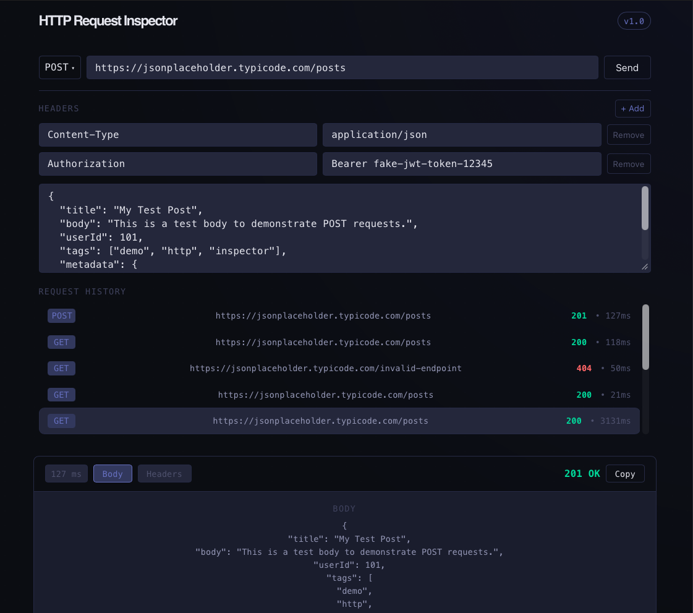
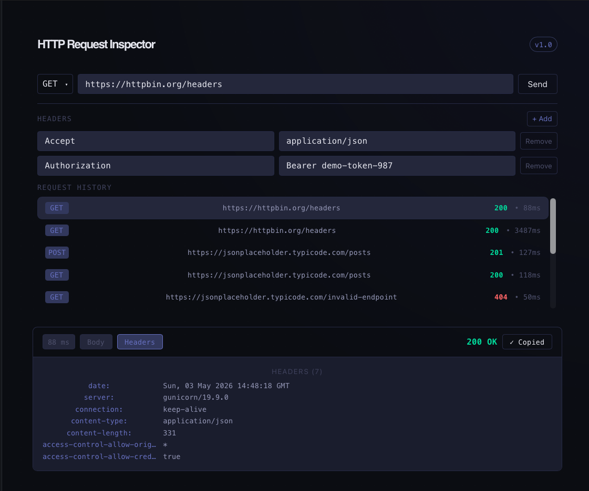
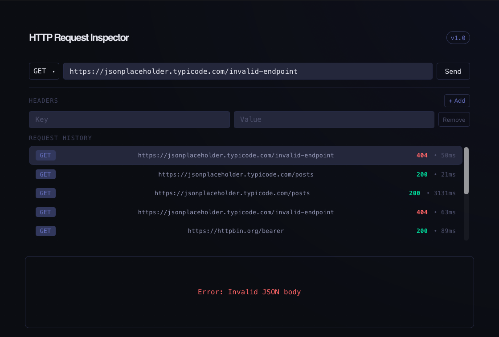
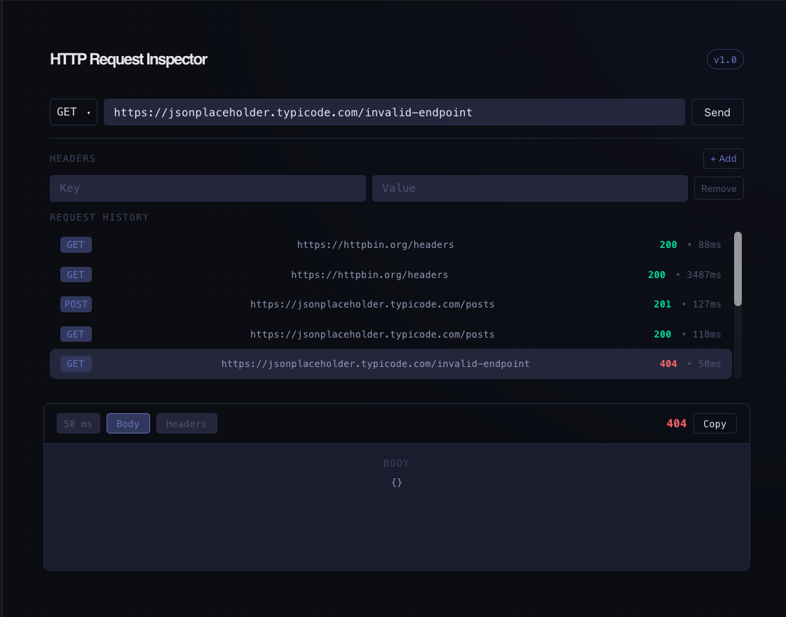

# HTTP Request Inspector



A Postman-like tool that allows users to create HTTP requests and inspect responses.

## 📝 Overview

HTTP Request Inspector is a full-stack application that allows users to build HTTP requests and inspect real responses from external APIs.

It simulates the core functionality of tools like Postman by enabling users to configure requests, send them through a backend proxy, and inspect structured responses.

This project demonstrates:
- React component architecture
- State management and data flow
- Client-server interaction patterns
- Designing and consuming REST APIs
- Persisting data with PostgreSQL

## 📸 Screenshots

### Main Interface

Build and configure HTTP requests with a clean, developer-focused UI.


### Successful Request

Inspect response status, headers, and body in real time.



### Error Handling (Invalid JSON)

Client-side validation prevents malformed requests before sending.



### Failed Request (404)

Gracefully handles server errors and displays meaningful feedback.




## 💻 Tech Stack

- Frontend: React (Vite)
- Backend: Node.js + Express (REST API)
- Database: PostgreSQL

## 🚀 Getting Started

### 1. Clone the Repository

```bash
git clone https://github.com/LextinBailey/http-request-inspector.git
cd http-request-inspector
```

### 2. Setup Backend

```bash
cd backend
npm install
cp .env.example .env
npm run dev
```

### 3. Setup Frontend

```bash
cd frontend
npm install
npm run dev
```

### This App will be Available at:

- Frontend: http://localhost:5173
- Backend: http://localhost:3000

## 🔄 Data Flow

Client → POST /requests 
→ Backend executes request 
→ Saves to PostgreSQL
       
Client → GET /requests
→ Returns persisted history
→ Frontend renders

## 🔥 Features

### 🛠️ Core Features

- [x] Build HTTP requests (GET, POST)
- [x] Dynamic custom headers
- [x] Request body support (POST)
- [x] Response inspection (status, headers, body)
- [x] Loading and error state handling
- [x] Copy response to clipboard

### 🧠 Data & Persistence

- [x] Requests persisted in PostgreSQL
- [x] Fetch history via GET `/requests`
- [x] History rehydration (restore past requests)
- [x] Database as single source of truth

### 👨‍💻 Developer Experience

- [x] Backend logging (incoming requests, fetch errors)

## ⚙️ How It Works Internally

⚠️ This section is optional and provides a deeper look into the architecture and design decisions behind the application.

### 1. Component Architecture

The application is structured around a top-level `App` component which manages all shared state.

It renders two child components:
- `RequestForm` → captures user input
- `ResponseViewer` → displays the response

### 2. State Management

The application uses a session-based state model with React Context for shared data

A global provider (`SessionProvider`) manages a centralized `session` object:
- `session.request` → current request configuration (URL, method, headers, body)
- `session.response` → latest response data from the backend

Additional UI state is managed locally within the application:
- `loading` → indicates an active request
- `error` → stores any request failure
- `history` → stores recent request/response sessions

Instead of managing multiple independent pieces of state (`url`, `method`, etc.), the application centralizes request/response into a single `session` object. This ensures consistency between the request being edited and the response being displayed.

The app follows React's unidirectional data flow:
- `SessionProvider` owns and distributes the shared `session` state
- `RequestForm` updates `session.request` (user input)
- `ResponseViewer` reads from `session.response` (output display)
- `App` coordinates UI state such as loading, errors, and request history

Design Reasoning for this Approach:
- Eliminates duplicated state
- Keeps request and response tightly coupled
- Separates global data (session) from UI state (loading/error/history)
- Makes restoring past requests (history) straightforward
- Mirrors how real API clients manage request/response lifecycles

Context is used for state distribution, while state ownership remains within the provider component.

### 3. Controlled Inputs

`RequestForm` uses controlled inputs:
- Input values are tied to state (`value={...}`)
- User input updates state via `onChange`

This ensures the UI always reflects the current application state.

### 4. Event Flow

When a request is sent:
1. `RequestForm` updates `session.request`
2. `App` sends the request to the backend
3. The response is stored in `session.response`
4. `ResponseViewer` automatically re-renders with the new data

### 5. Request Lifecycle

Frontend:
- `loading` is set to `true`
- Errors are cleared
- Sends a request to the backend (`POST /requests`)

Backend:
- Handles `POST /requests`
    - Extracts request config (`url`, `method`, `headers`, `body`)
    - Calls service layer to execute HTTP request
    - Measures response time
    - Converts headers to plain object
    - Persists request + response data into PostgreSQL
    - Returns structured response (`status`, `headers`, `body`, `time`)
- Handles `GET /requests`
    - Retrieves recent requests from database
    - Returns them to frontend

After a successful request:
- Frontend calls `GET /requests`
- Normalizes database records into UI-friendly format
- Updates request history state

### 6. Conditional Rendering

`ResponseViewer` renders different UI based on application state:

- If `loading` → displays "Sending request..."
- If `error` → displays error message
- If no response → displays placeholder
- Otherwise → displays response data

### 7. Rendering Response Data

Response headers are stored as an object and rendered dynamically using:

`Object.entries(headers).map(...)`

This converts key-value pairs into UI elements.

Handles missing or undefined data to prevent UI crashes.

### 8. Request History

Request history is stored in PostgreSQL and retrieved via `GET /requests`.

On initial load:
- Frontend fetches persisted history from backend
- Data is normalized to match UI structure

After each request:
- Backend saves the request
- Frontend re-fetches history to stay in sync

This ensures a single source of truth and persistence across sessions.

### 9. Request History Rehydration

When user selects a request from request history, `RequestForm` calls the `onSelectHistory` function passed from `App`.

`populateRequest` restores full state to synchronize form and response viewer from history.

### 10. Custom Request Headers

User can dynamically add and remove request headers via the UI.

Header inputs are stored as an array object in state.

On request submission, this array is transformed into a key-value object (`headersMap`) to match the expected HTTP headers format.
Empty header keys are filtered out to prevent invalid requests.

This object is sent to the backend in the POST `/requests` payload, where it is then passed directly into the `fetch` call to configure the outgoing HTTP request.

### 11. Post Support

When the selected request method is `POST`, a textarea is conditionally rendered to allow users to input a request body.

The body is managed as a controlled string state to support raw input (JSON or text).

On request submission:
- If `Content-Type: application/json` is present, the body is validated using `JSON.parse`
- Invalid JSON prevents the request and triggers an error state

The body is then included in the POST `/requests` payload.

On the backend, the request body is only attached to the outgoing `fetch` call when the method is `POST` and the body is non-empty.

### 12. Copy Response

When a user clicks 'Copy':
- `handleCopy()` tries to copy `formattedBody` to the clipboard (`navigator.clipboard.writeText(formattedBody)`)
- If copying failed, the error is caught and logged
- UI updates to display successful 'Copied' feedback

UI is reset on `response` state update.

## 📁 Project Structure

```
http-request-inspector/
├── backend/
│   ├── .env.example
│   └── src/
│   │   ├── db/
│   │   │   ├── db.js
│   │   ├── controllers/
│   │   │   ├── requestController.js
│   │   ├── routes/
│   │   │   ├── requestRoutes.js
│   │   ├── services/
│   │   │   ├── httpService.js
│   │   └── server.js
├── frontend/
│   ├── src/
│   │   ├── App.jsx
│   │   └── components/
│   │   │   ├── RequestForm.jsx
│   │   │   ├── ResponseViewer.jsx
│   │   │   ├── BodyTab.jsx
│   │   │   └── HeadersTab.jsx
├── screenshots/
│   ├── 404.png
│   ├── error.png
│   ├── get.png
│   └── post.png
├── progress-log.md
└── README.md
```

## 📈 Development Notes

Progress and development insights are tracked in `progress-log.md`.

## 🚧 Status

Feature Complete (Core Functionality)

Currently focusing on:
- UI/UX polish
- Deployment (frontend + backend)
- Potential enhancements (auth, collections)